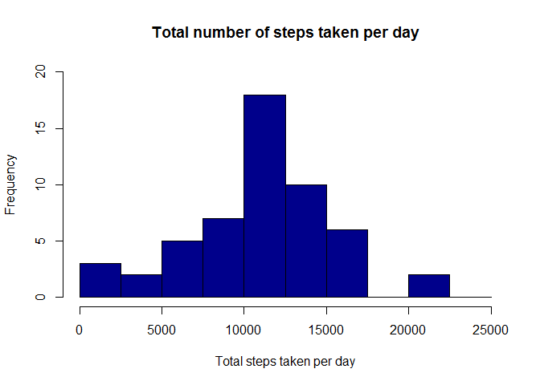
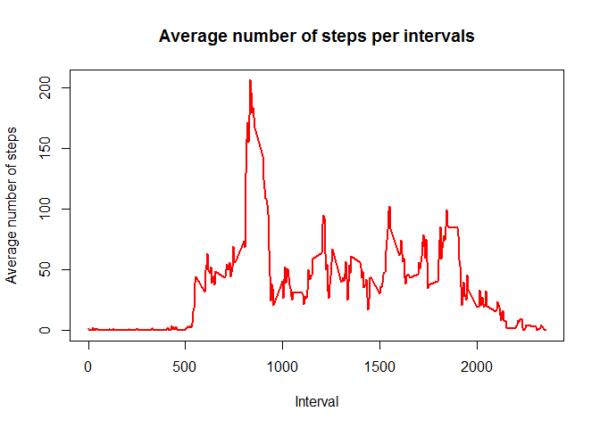
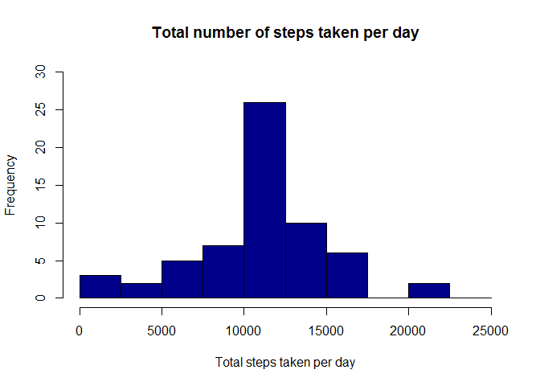
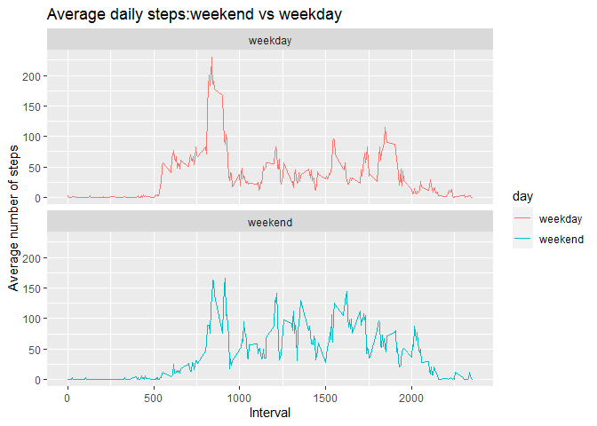

This report adresses the objectives of the first project under Reproducible Research course. 

## Data    
The data for this assignment can be downloaded from the course web site:  
Dataset: [Activity monitoring data [52K]](https://d396qusza40orc.cloudfront.net/repdata%2Fdata%2Factivity.zip)  

The variables included in this dataset are:

- **steps**: Number of steps taking in a 5-minute interval (missing values are coded as \color{red}{\verb|NA|}NA)  
- **date**: The date on which the measurement was taken in YYYY-MM-DD format  
- **interval**: Identifier for the 5-minute interval in which measurement was taken


## Loading and preprocessing the data  

Firstly we supress warnings, load the data and transform them is a format suitable for the analysis.


```r
options(warn=-1)
data<-read.csv("activity.csv",header=TRUE)
data$steps<-as.numeric(data$steps)
data$date<-as.POSIXct(data$date,"%Y-%m-%d")
head(data)
```

```
##   steps       date interval
## 1    NA 2012-10-01        0
## 2    NA 2012-10-01        5
## 3    NA 2012-10-01       10
## 4    NA 2012-10-01       15
## 5    NA 2012-10-01       20
## 6    NA 2012-10-01       25
```


## What is mean total number of steps taken per day?  

In this section we calculate the total number of steps taken per day and make a histogram of the total number of steps taken each day. Finally we calculate and report the mean and median of the total number of steps taken per day.  


```r
tl_steps<-aggregate(steps~date,data,sum,na.rm = TRUE)
hist(tl_steps$steps,main = "Total number of steps taken per day", 
xlab = "Total steps taken per day", col = "darkblue", ylim = c(0,20), breaks = seq(0,25000, by=2500))
```

<!-- -->


```r
mean(tl_steps$steps,na.rm = TRUE)
```

```
## [1] 10766.19
```

```r
median(tl_steps$steps,na.rm = TRUE)
```

```
## [1] 10765
```


## What is the average daily activity pattern?

Here we make a time series plot (i.e. \color{red}{\verb|type = "l"|}type = "l") of the 5-minute interval (x-axis) and the average number of steps taken, averaged across all days (y-axis) and following we find Which 5-minute interval, on average across all the days in the dataset, contains the maximum number of steps.  


```r
av_steps<-aggregate(steps~interval,data,mean,na.rm=TRUE)
names(av_steps)<- c("interval","mean")
plot(av_steps$interval,av_steps$mean,type = "l", col="red", 
lwd = 2, xlab="Interval", ylab="Average number of steps", main="Average number of steps per intervals")
```

<!-- -->

**5-minute interval that contains the maximum number of steps**  

```r
max<-which.max(av_steps$mean)
av_steps[max,1]
```

```
## [1] 835
```

## Imputing missing values

in this section we devise a strategy for filling in all of the missing values in the dataset, using the mean for that day. Next, we create a new dataset with no NAs and make a histogram of the total number of steps taken each day.Finally we calculate and report the mean and median total number of steps taken per day.  

**Total number of NAs**

```r
sum(is.na(data$steps))
```

```
## [1] 2304
```

**Fill NAs with the mean for that day**

```r
x<-av_steps$mean[match(data$interval,av_steps$interval)]
comlpete_data<-transform(data, steps = ifelse(is.na(data$steps), yes = x, no = data$steps))
```

**histogram of total steps taken per date on complete data**

```r
tl_steps_complete<-aggregate(steps~date,comlpete_data,sum,na.rm = TRUE)
hist(tl_steps_complete$steps,main = "Total number of steps taken per day", 
xlab = "Total steps taken per day", col = "darkblue", ylim = c(0,30), breaks = seq(0,25000, by=2500))
```

<!-- -->

**Calculate the mean and median of the total number of steps taken per day for complete data**

```r
mean(tl_steps_complete$steps)
```

```
## [1] 10766.19
```

```r
median(tl_steps_complete$steps)
```

```
## [1] 10766.19
```


## Are there differences in activity patterns between weekdays and weekends?

To answer this question we:  
1.Create a new factor variable in the dataset with two levels – “weekday” and “weekend” indicating whether a given date is a weekday or weekend day.  
2.Make a panel plot containing a time series plot (i.e. \color{red}{\verb|type = "l"|}type = "l") of the 5-minute interval (x-axis) and the average number of steps taken, averaged across all weekday days or weekend days (y-axis).  

**Create a new factor variable in a new column**

```r
weekday<-weekdays(data$date)
final_data<-cbind(comlpete_data,weekday)
names(final_data[,4])<-"weekday"
final_data$day<-sapply(final_data$date,function(x) {
   if (weekdays(x)=="Saturday"|weekdays(x)=="Sunday")
      {y<-"weekend"} else
      {y<-"weekday"}
       y
  })
```
**Plot of the 5-minute interval and the average number of steps**

```r
library(ggplot2)
daily_steps<- aggregate(steps~interval + day, final_data, mean)
panelplot<- ggplot(daily_steps, aes(x = interval , y = steps, color = day)) +
       geom_line() +
       labs(title = "Average daily steps:weekend vs weekday", x = "Interval", y = "Average number of steps") +
       facet_wrap(~day, ncol = 1, nrow=2)
print(panelplot)
```

<!-- -->


